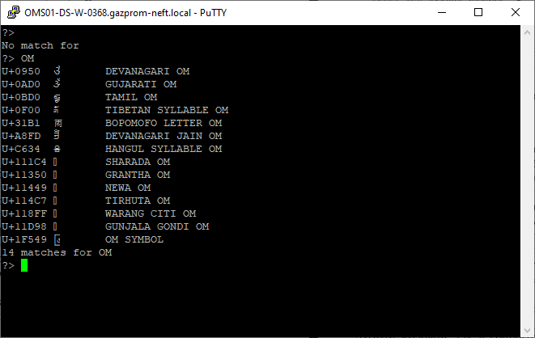

:icons: font

=== `asyncio.Future`: не блокирует умышленно

Интерфейс классов `asyncio.Future` и `concurrent.futures.Future` в основном совпадает, но реализация разная.

"In the future (pun intended) we may unify asyncio.Future and concurrent.futures.Future, e.g. by adding an __iter__() method to the latter that works with yield from."
-- https://peps.python.org/pep-3156/

Как и `concurrent.futures.Future`, класс `asyncio.Future` предоставляет метода `.done()`, `.add_done_callback(...)`, `results()`, а также ряд других. Первые два метода работают так же, как описано в разделе "Где находятся будущие объекты?" Главы 17, но вот метод `.result()` очень сильно отличается.

В классе `asyncio.Future` метод `.result()` не принимает аргументов, т.е. задать timeout невозможно. Кроме того, если в момент вызова `.result()` выполнение будущего объекта ещё не завершилось, то программа не блокируется в ожидании результата, а возбуждает исключение `asyncio.InvalidStateError`.

NOTE: Обычно для получения результата `asyncio.Future` используется `await`.

Когда `await` используется с будущим объектом, система автоматически позаботится о том, чтобы дождаться его завершения не блокируя цикл обработки событий, -- потому что в `asyncio` выражение `yield from` уступает управление именно циклу обработки событий.

Отметим, что использование `await` с будущими объектами можно рассматривать как сопрограммный эквивалент функциональности метода `add_done_callback`: вместо активации обратного вызова по завершении отложенной операции цикл обработки событий устанавливает результат будущего объекта, а выражение `await` отдает возвращенное значение приостановленной сопрограмме, давая ей возможность возобновить выполнение.

=== `await` из будущих объектов, задач и сопрограмма

Для выполнения сопрограмма должна быть сначала запланирована, а затем она обёртывается объектом `asyncio.Task`. Имея сопрограмму, получить объект `Task` можно двумя основными способами:

 * `asyncio.async(coro_or_future, *, loop=None)` -- унифицирует сопрограммы и будущие объекты: первый аргумент может быть как тем, так и другим. Если аргумент имеет тип `Future` или `Task`, то он возвращается без изменения. Если же это сопрограмма, то `async` вызывает для него функцию `loop.create_task(...)`, которая создаёт объект `Task`. Можно так же передать необязательный именованный аргумент `loop=` содержащий ссылку на цикл обработки событий; если он опущен, то `async` получает объект `loop` от функции `asyncio.get_event_loop()`.

 * `BaseEventLoop.create_task(coro)` -- планирует выполнение сопрограммы и возвращает объект `asyncio.Task`. Если он переопределён в подклассе `BaseEventLoop`, то возвращённый объект может быть экземпляром другого совместимого с `Task` класса, предоставляемого внешней библиотекой (пр., Tornado).

.Если вы хотите поэкспериментировать с будущими объектами и сопрограммами в оболочке Python, то можете воспользоваться следующим фрагментом.
[source, doctest]
----
>>> import asyncio
>>> def run_sync(coro_or_future):
...     loop = asyncio.get_event_loop()
...     return loop.run_until_complete(coro_or_future)
>>> a = run_sync(some_coroutine())
----

Связь между программами, будущими объектами и задачами документирована в разделе https://docs.python.org/3/library/asyncio-task.html["Задачи и сопрограммы"] документации по `asyncio`.

.The `asyncio.run()` function to run the top-level entry point `main()` function.
[source, doctest]
----
>>> import time
>>> async def say_after(delay, what):
...    await asyncio.sleep(delay)
...    print(what)

>>> async def main():
...    print(f'started at {time.strftime("%X")}')
...    await say_after(1, 'hello')
...    await say_after(2, 'world')
...    print(f'finished at {time.strftime("%X")}')

>>> asyncio.run(main())
----

.The `asyncio.create_task()` function to run coroutines concurrently as asyncio Tasks.
[source, doctest]
----
>>> async def main():
...    task1 = asyncio.create_task(say_after(2, 'hello'))
...    task2 = asyncio.create_task(say_after(1, 'world'))
...    print(f"start at {time.strftime('%X')}")
...    await task1
...    await task2
...    print(f"finished at {time.strftime('%X')}")

>>> asyncio.run(main())
----

=== Загрузка с применением `asyncio` и `aiohttp`

В версии Python 3.4 сам модуль `asyncio` поддерживает только протоколы `TCP` и `UDP`. Для `HTTP` и других протоколов понадобятся сторонние пакеты. Для программирования асинхронных клиентов и серверов HTTP в настоящее время практически все пользуются пакетом `aiohttp`.

.`flags_asyncio.py`: асинхронный скрипт загрузки с применением `asyncio` и `aiohttp`
[source, python]
----
include::../source/flags_asyncio.py[]
----

Это напоминает пример, который мы рассматривали в разделе "Моделирование работы таксопарка" главы 16, где в главном цикле поочередно запускалось несколько процессов такси. Когда процесс некоторого такси поочерёдно запускалось несколько процессов такси. Когда процесс некоторого такси уступал управление, главный цикл планировал следующее событие этого такси (в будущем) и переходил к активации следующего такси в очереди. Моделирование такси гораздо проще, его главный цикл легко понять. Но общий поток управления в `asyncio` такой же: одно поточная программа, в которой главный цикл активирует находящийся в очереди сопрограммы одну за другой. Каждая сопрограмма выполняет какие-то действия, а затем уступает главному циклу, который активирует следующую сопрограмму.

Функция `loop.run_until_complete` принимает будущий объект или сопрограмму. Получив сопрограмму, она обёртывает ее объектом `Task` -- так же, как `wait`. Сопрограммами, будущими объектами и задачами можно управлять с помощью `await`, именно это и делает функция с объектом `wait_coro`, полученным от `wait`. Когда выполнение `wait_coro` завершится, оно вернёт 2-кортеж, в котором первый элемент - это множество завершённых будущих объектов, а второй - множество тех, которые ещё не завершились.

.Пример запроса к точке API с использованием `aiohttp`
[source, python]
----
include::../source/aiohttp_example.py[]
----

=== Улучшение скрипта загрузки на основе `asyncio`

==== Использование asyncio.as_completed

В примере я передавал функции `asyncio.wait` список сопрограмм, которые - под управлением метода `loop.run_until.complete` - должны возвращать результаты загрузки, но только когда завершатся все. Однако, чтобы обновить индикатор хода выполнения, нам нужно получать результаты по мере готовности. К счастью, в пакете `asyncio` есть эквивалент генераторной функции `as_completed`, которой мы пользовались в скрипте на основе пула потоков.

Для кодирования `flags2`-примера на основе `asyncio` нам придётся переписать несколько функций, которые в версии на базе `concurrent.future` можно было использовать повторно. Дело в том, что в программе на основе `asyncio` имеется всего один главный поток, и мы не можем допустить в нём блокирующих вызовов, так как в этом же потоке работает цикл обработки событий. Поэтому я был вынужден переписать `get_flag`, чтобы для всех операций доступа к сети использовалось `yield from`. Теперь `get_flag` стала сопрограммой, поэтому `download_one` должна управлять ей с помощью `yield from`, а, значит, и `download_one` становится сопрограммой. Ранее в примере функцией `download_one` управляла `download_many`: обращения к `download_one` были обёрнуты вызовом `asyncio.wait` и передавались методу `loop.run_until_complete`. Теперь для индикации хода выполнения и обработки ошибок нам необходимо более точное управление, поэтому я перенёс большую часть логики `download_many` в новую сопрограмму `download_coro`, а `download_many` используется только для подготовки цикла обработки событий и планирования `download_coro`.

.`flags2_asyncio.py`: первая часть скрипта...
[source, python]
----
include::../source/flags2_asyncio.py[lines=1..87]
----

Из примера видно, что функция get_flag и download_one существенно изменилась по сравнению с последовательной версией, т.к. теперь они стали сопрограммами, в которых для асинхронных вызовов используется `await`.

В сетевых клиентах такого типа всегда следует использовать механизм дросселирования, чтобы не перегружать сервер чрезмерно большим количеством одновременных запросов, что могло бы привести к снижению общей производительности системы. В скрипте `flags2_threadpool.py` для дросселирования используется класс `ThreadPoolExecutor`, обязательный аргумент которого `max_workers` устанавливался равным значению `concur_req` в функцию `download_many`; таким образом, пул включал не более `concur_req` потоков.

.`flags2_asyncio.py`: вторая часть скрипта...
[source, python]
----
include::../source/flags2_asyncio.py[lines=88..]
----

В примере мы не могли воспользоваться отображением будущих объектов на коды стран, потому что будущие объекты, возвращаемые функцией `asyncio.as_complete`, необязательно совпадают с будущими объектами, переданными `as_completed` при вызове. Внутри себя `asyncio` подменят одни будущие объекты другими, дающими тот же самый конечный результат:footnote:[Подробное обсуждение этого вопроса можно найти в группе `python-tulip`, она озаглавлена https://groups.google.com/g/python-tulip/c/PdAEtwpaJHs/m/7fqb-Qj2zJoJ["Which other futures my come out of asyncio.as_completed?"]].

Раз не получается использовать будущие объекты в качестве ключей для поиска кода страны в словаре в случае ошибки, то мне пришлось написать собственный класс исключения `FetchError`. Объект `FetchError` обёртывает сетевое исключение и хранит ассоциированный с ним код страны, что даёт возможность вывести этот код в составе сообщения об ошибке при работе в режиме подробной информации. Если ошибки не было, то код страны становится доступен в виде результата выражения `await future` в начале цикла `for`.

==== Использование исполнителя для предотвращения блокировки цикла обработки событий

В сообществе Python как-то не обращают внимание на тот факт, что доступ к локальной файловой системе -- блокирующая операция, оправдываясь тем, что задержки в этом случае несравнимы с возникающими при доступе к сети.

В примере блокирующей является функция `save_flag`. В многопоточной версии скрипта `save_flag` блокирует функцию `download_one`, но это лишь один из нескольких рабочих потоков. За кулисами блокирующий вызов ввода-вывода освобождает GIL, так что другой поток получает возможность поработать. Однако в скрипте `flags2_asyncio.py` функция `save_flag` блокирует единственный поток, который наш код разделяет с циклом обработки событий `asyncio`, т.е. на время сохранения файла всё приложение зависает. Решить проблему позволяет метод `run_in_executor` объекта, представляющего цикл обработки событий.

В реализации цикла обработки событий `asyncio` есть исполнитель на основе пула потоков, а метод `run_in_executor` даёт возможность передать ему вызываемые объекты, подлежащие выполнению. Чтобы применить эту идею к нашему примеру, достаточно изменить всего несколько строк в сопрограмме `download_one`.

.`flags2_asyncio_executor.py`: вторая часть скрипта...
[source, python]
----
include::../source/flags2_asyncio_executor.py[]
----

Преимущества сопрограмм по сравнению с обратными вызовами становится несомненным, когда мы пытаемся координировать асинхронные запросы, а не просто выполнять независимые запросы. В следующем разделе объясняется, в чём состоит проблема и как её решить.

==== Выполнение нескольких запросов для каждой операции

Если к примеру нам надо сохранить не только само изображение, но и название страны, придётся делать два HTTP-запроса на каждый флаг. Один для загрузки картинки, второй для загрузки метаданных.

В многопоточном скрипте выполнить несколько запросов в составе одной задачи нетрудно: достаточно расположить их один за другим(при этом поток будет блокироваться дважды) и запомнить оба элемента данных (код и название страны) в локальных переменных, которые можно будет использовать при сохранении файлов.

CAUTION: Попытавшись сделать то же самое в асинхронном скрипте с помощью обратных вызовов, мы почувствуем серный запах ада: код и название страны придётся передавать в замыкании или запоминать где-то до момента сохранения файла, потому что функция обратного вызова исполняется в совершенно другом локальном контексте. *Сопрограммы и `await` избавляют нас от этого.*

Ниже в примере представлен код из третьего варианта скрипта загрузки флагов с применением `asyncio`, только имя файла, в котором сохраняется флаг, образованно на основе названия страны. Функция `download_many` и `download_coro` так же, как в файле `flags2_asyncio.py`.

.`flags2_asyncio.py`: количество вызовов сопрограмм увеличилось, поскольку для каждого флага выполняется два запроса.
[source, python]
----
include::../source/flags3_asyncio.py[]
----

=== Разработка серверов с помощью пакета asyncio

Классический пример "игрушечного" TCP-сервера -- сервер эхо-контроля. Но мы разработаем чуть более интересные игрушки: сервер поиска символов Unicode -- сначала по протоколу TCP, а затем HTTP. Эти серверы позволяют клиентам запрашивать символы Unicode, в канонических именах которых встречаются заданные слова. Для этой цели мы воспользуемся модулем `unicodedata`.

==== TCP-серверна основе asyncio

.`charfinder.py`
[source, python]
----
include::../source/charfinder.py[]
----

.`tcp_charfinder.py`: простой TCP-сервер с применением функции `asyncio.start_server`; код этого модуля продолжается в следующем примере.
[source, python]
----
include::../source/tcp_charfinder.py[lines=1..76]
----

TIP: Слово _queries_ в имени сопрограммы `handle_queries` указано во множественном числе, потому что эта сопрограмма начинает интерактивный сеанс и обрабатывает по несколько запросов от каждого клиента.

Небольшая проблема заключается в том, что некоторые методы ввода-вывода являются сопрограммами и должны управляться посредством `await`, тогда как другие обычные функции.

.`tcp_charfinder.py`: ... продолжение. Функция main.
[source, python]
----
include::../source/tcp_charfinder.py[lines=77..]
----

.Пример работы TCP-сервера
[source, commandline]
----
(venv) C:\Users\Khomyakov.As\Documents\Python\Fluent-Python\source>py tcp_charfinder.py
Serving on ('127.0.0.1', 2323). Hit Ctrl+C to stop.
Received from ('127.0.0.1', 49981):
Sent 0 results
Received from ('127.0.0.1', 49981): OM
Sent 14 results
----

.Сеанс telnet.

NOTE: В скрипте `tcp_charfinder.py` мы воспользовались высокоуровневым интерфейсом `Streams API`, включённым в пакет `asyncio` (https://docs.python.org/3/library/asyncio-stream.html), который предоставляет готовый сервер. Так что нам нужно только реализовать функцию-обработчик, которая может быть как простым обратным вызовом, так и сопрограммой.

NOTE: Существует так же низкоуровневый интерфейс `Transports and Protocol API` (https://docs.python.org/3/library/asyncio-protocol.html), построенный по образцу абстракции транспорта и протоколов из библиотеки `Twisted`.

=== Веб-сервер на основе библиотеки aiohttp

Библиотек `aiohttp` поддерживает также и программирование HTTP-серверов, поэтому я взял её для реализации скрипта `http_charfinder.py`

Начнём анализ с самой интересной части скрипта, где находится цикл обработки событий и производится инициализация и закрытие HTTP-сервера.

.`http_charfinder.py`: функции `main` и `init`
[source, python]
----
include::../source/http_charfinder.py[]
----

==== Повышение степени параллелизма за счёт более интеллектуальных клиентов

Функция `home` очень похожа на функцию представления Django или Flask. В ее реализации нет ничего асинхронного: она получает запрос, читает данные из базы и строит ответ, отрисовывая полную HTML-страницу. В данном примере "базой данных" является объект `UnicodeNameIndex`, хранящийся в памяти. Но к настоящей базе данных следует обращаться асинхронно, в противно случае цикл обработки событий окажется блокированным в ожидании результатов. Например, пакет `aiopg` предоставляет асинхронный драйвер СУБД PostgresSQL, совместимый с `asyncio`; он позволяет использовать `await` для отправки запросов и получения результатов, поэтому функция представления может вести себя как сопрограмма.

Если сделать запрос `cjk` то сервер выдаст 94061 запись. А это дохуя. И что бы такого избежать, можно ввести пагинацию и использовать либо AJAX, либо даже WebSocket для отправки следующей порции данных (если это требуется).

Хотя интеллектуальные клиенты могут улучшить даже Django приложения, написанные по старинке, для полноценного использования всех их возможностей необходима поддержка асинхронного программирования на всех стадиях: от обработки HTTP-запросов и ответов до доступа к БД. Особенно это относится к реализации служб реального времени, например игр или потокового мультимедиа, с помощью WebSockets.

=== Дополнительная литература

* https://peps.python.org/pep-3156/[PEP 3156 – Asynchronous IO Support Rebooted: the “asyncio” Module]

NOTE: Большая часть руководства по asyncio посвящена концепциям и API. По тексту разбросано много полезных диаграмм и примеров, но для практического применения хочется особенно отметить раздел  https://docs.python.org/3/library/asyncio-dev.html[18.5.11 "Разработка с применением asyncio"].

* https://speakerdeck.com/pycon2014/fan-in-and-fan-out-the-crucial-components-of-concurrency-by-brett-slatkin?slide=4[Fan-in and Fan-out: The crucial components of concurrency by Brett Slatkin]