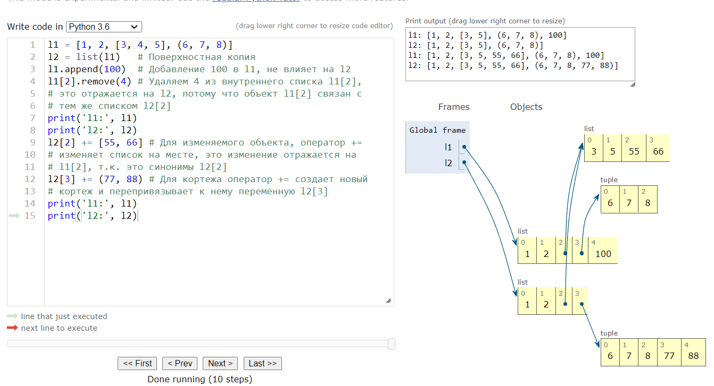
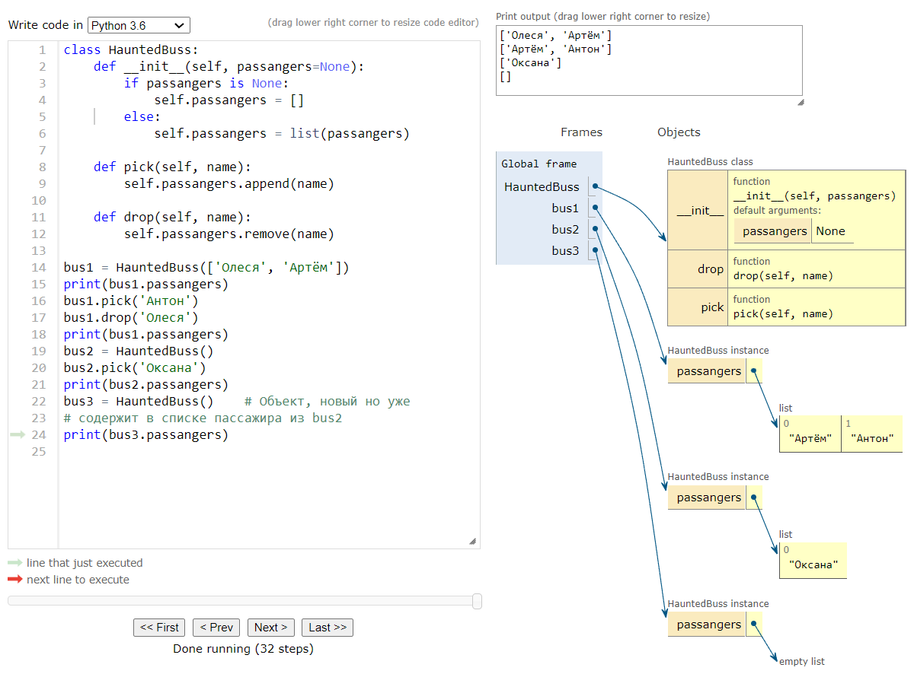
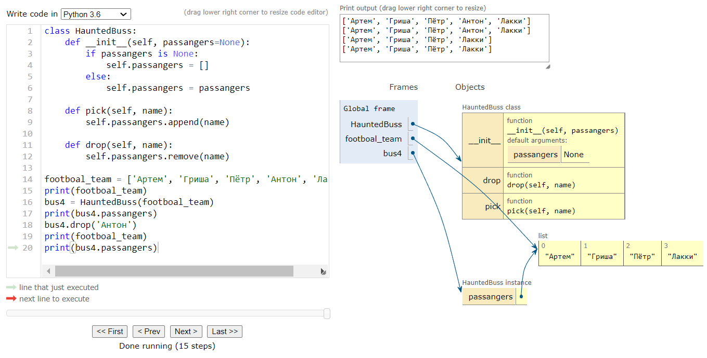

include::./.asciidoctor/.asciidoctorconfig[]

== Глава 8. Ссылки на объекты

TIP: Для правильного понимания присваивания в Python всегда сначала читайте правую часть, ту, где объект создается
или извлекается. Уже после этого переменная в левой части связывается с объектом -- как приклеенная к нему этикетка.

Поскольку переменные -- это просто этикетки, ничего не мешает наклеить на объект несколько этикеток. В этом случае
образуются _синонимы_.

=== Выбор между `==` и `is`

Оператор `==` сравнивает значение объектов (хранящихся в нем данных), а оператор `is` -- их `id`.

=== Относительная неизменность кортежей

Кортежи, как и большинство коллекций в Python, -- списки, словари, множества и т.д. -- хранят ссылки на объекты.
Если элементы, на которые указывают ссылки, изменяемы, то их можно модифицировать, хотя сам кортеж останется неизменяемый.

=== По умолчанию копирование поверхностное

.Cоздание поверхностной копии списка, содержащий другой список;

NOTE: Теперь должно быть понятно, что создать поверхностную копию легко, но это не всегда то что нужно.

TIP: Для значений по умолчанию `def func(a=default):` необходимо устанавливать значение None, а не изменяемые пустые объекты типо `[]`.
Это может привести к изменению объекта установленного по умолчанию и во вновь созданных объектах будут фантомные
объекты.

.Ошибка при назначении по умолчанию изменяемого объекта
image:./images/pythontutor.com_2.png[width=900]

При написании функции, принимающий изменяемый параметр, необходимо тщательно обдумывать, ожидает ли принимающая сторона,
что аргумент может быть изменён.

.Пример правильной реализации

TIP: Важное замечание. В объекте автобуса при инициализации создается копия списка. Это исключает ошибки связанной с
изменением объекта переданного при инициализации.

[source, python]
----
include::{sourcedir}/buss.py[]
----

.doctest для проверки корректного автобуса
[source, doctest]
----
include::{doctestdir}/buss_correct.txt[]
----

.Если сделать вот так:
[source, python]
----
self.passangers = passangers
----

.То футбольная команда потеряет одного игрока вместе с выходом из автобуса.
[source, doctest]
----
doctest.testfile('./source/doctest/buss_correct.txt')
**********************************************************************
File ".\source\doctest\buss_correct.txt", line 21, in buss_correct.txt
Failed example:
    footboal_team
Expected:
    ['Артем', 'Гриша', 'Пётр', 'Антон', 'Лакки']
Got:
    ['Артем', 'Гриша', 'Пётр', 'Лакки']
**********************************************************************
1 items had failures:
   1 of  17 in buss_correct.txt
***Test Failed*** 1 failures.
TestResults(failed=1, attempted=17)
----

.Визуализация потери игрока

NOTE: Если метод специально не предназначен для изменения объекта, полученного в качестве аргумента, то стоит дважды
подумать создавая синоним аргумента, просто присваивая его атрибуту экземпляра в своём классе. Если сомневаетесь,
делайте копию. Клиенты обычно будут только рады.

=== del и сборка мусора

Предложение `del` удаляет имена, а не объекты. Это может привести к отсутствию ссылок и может быть удалён сборщиком мусора. Привязывание переменной к другому объекту так же может обнулить количество ссылок на объект, что так же приведёт к уничтожению.

CAUTION: Существует специальный метод `\\__del__`, но он не приводит к уничтожению экземпляра. И Вы не должны вызывать его вручную. Метод `\\__del__` вызывается интерпретатором *Python* непосредственно перед уничтожением объекта, давая ему возможность освободить внешние ресурсы.

=== Слабые ссылки

Наличие ссылок -- вот что удерживает объект в памяти. Слабые ссылки на объект не увеличивают счётчик ссылок. Слабая ссылка не препятствует уничтожению объектов.

Слабые ссылки хороши для хранения хэш значений.

TIP: *weakref* - модуль для работы с множествами и слабыми ссылками.

`weakref.ref` создает слабую ссылку на объект.
